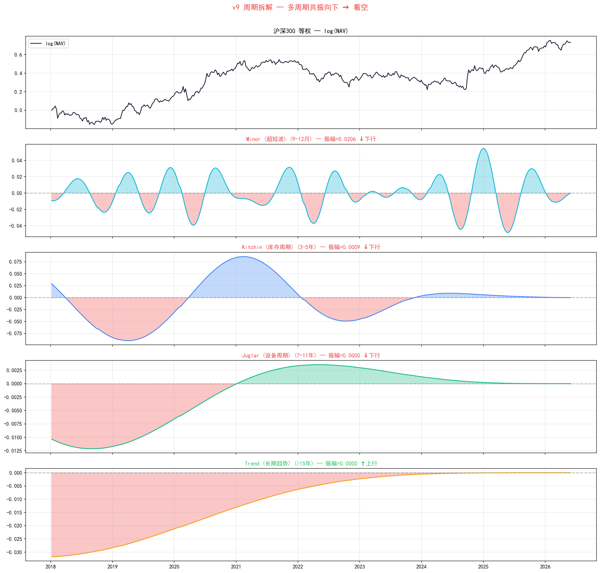
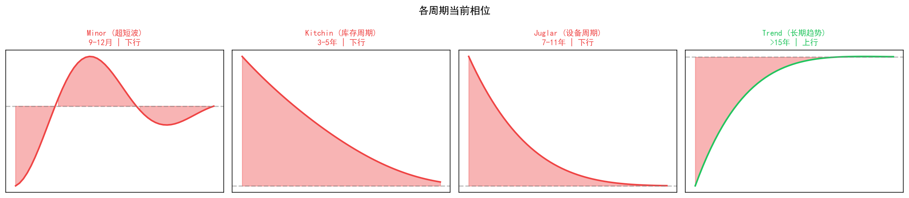

# 沪深300 周期拆解报告
> 数据: 2018-01-07 ~ 2026-05-31
> 方法: 带通滤波 (Butterworth)

## 各周期识别

| 周期 | 典型时长 | 振幅 | 当前值 | 趋势 |
|------|---------|------|--------|------|
| Minor (超短波) | 9-12月 | 0.0206 | +0.0001 | ↓下行 |
| Kitchin (库存周期) | 3-5年 | 0.0009 | +0.0001 | ↓下行 |
| Juglar (设备周期) | 7-11年 | 0.0000 | +0.0000 | ↓下行 |
| Trend (长期趋势) | >15年 | 0.0000 | +0.0000 | ↑上行 |

## 综合判定
**多周期共振向下 → 看空**

